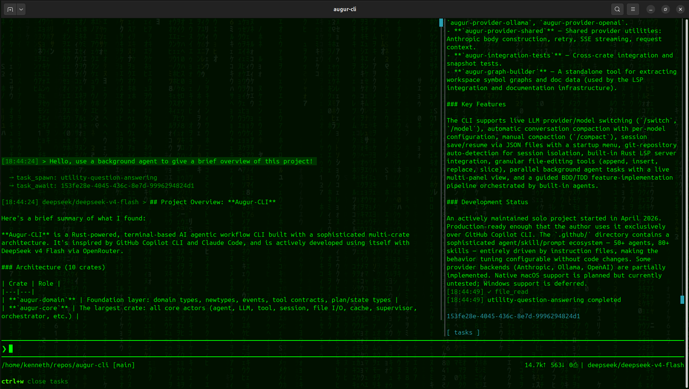

## Rust-Powered Agentic Workflow CLI



This is a lightweight to run, but feature heavy, agentic CLI inspired by other tools like [Github Copilot CLI](https://github.com/features/copilot/cli/) and [Claude Code](https://claude.com/product/claude-code).

Augur-CLI is written in [Rust](https://rust-lang.org/) and heavily tuned for building Rust applications. This project includes the CLI source code, instruction files, built in agentic conversation flow, and a guided feature implementation pipeline. 

Currently the work on Augur-CLI is done using Augur-CLI and Deepseek v4 Flash via [Openrouter](https://openrouter.ai/). The repo root contains an installation bash script for installing the compiled rust binary from source into your home directory in .augur-cli, complete with configuration files alongside easily accessible directories for holding logs and session files. 

While it is tuned towards developing Rust applications, the tuning is entirely contained within the agent and skill files in /.github/, so updates to the instruction files would enable projects in other major programming languages. The design tries to make careful use of Openrouter's automatic caching to reduce costs. In my experience, a 100 million token session has a cost of roughly **$4** using Deepseek v4 Flash, so it's significantly cheaper than equivalent output from any other frontier model. 

This is a weekend solo-project that I started early April 2026, so there's rough edges, but it's production-ready enough that I switched from using Github Copilot CLI to using exclusively Augur-CLI for development. I find Deepseek v4 Flash to be roughly comparable in quality to Claude Sonnet 4.6, at a fraction of the cost, especially after caching. 

The goal is feature parity with other major LLM CLI platforms, plus quality-of-life upgrades that I found to be useful for my workflows. As an example of QoL, this detects when you launch from inside a git repository, and creates a dedicated conversation session directory and logging directory in the home config directory, so you don't have cross-repository contamination of your context by default.

### Quick-Installation (Linux)

Linux users can run the online installer to download and install the latest binary with supporting config files.

```bash 
bash <(curl -sL https://raw.githubusercontent.com/Kenneth-Posey/augur-cli/main/online-installer.sh)
```

### Configuration

The priority for loading configuration including .github files and the user/application is local directory first, then user home .augur-cli, then hardcoded defaults. The user home configuration is seeded on first launch if it doesn't already exist, so you'll need to update your application.secret.yml with API keys if you're not using the github copilot cli sdk integration. 

### Disclaimer and OS Warning

This was developed on Ubuntu 24, and while native MacOS versions are on my to-do list, I want to be more feature complete before I dedicate to going cross-platform with testing. Augur-CLI uses the fantastic [Ratatui](https://ratatui.rs/) terminal-UI library, and it should hopefully work out of the box, but I'm leaning heavily on the library's cross-platform support. 

For MacOS, it should work running from source using [the dev launcher](augur-cli/launch-dev.sh) or [local source installer](augur-cli/install.sh). You should make sure the configuration file paths are correct and add your SDK keys to the application.secrets.yaml file. Refer to the [Install documentation](augur-cli/docs/INSTALL.md) for details. 

For [Windows with WSL](https://learn.microsoft.com/en-us/windows/wsl/install), it should work fine once you have rust and git installed, since WSL is linux. Clone your repos inside WSL, install Augur-CLI and work on your code inside the WSL environment. It's an option to mount your existing windows directories into WSL but you'll probably find some performance hits. You would need to set up Github Copilot SDK CLI inside WSL if you want to use that layer.

For Windows native support, good luck for now. I abandoned windows as an operating system last year when Win10 went out of support and I have been using exclusively MacOS (work computer) and Ubuntu (personal computer) since then. I'm perfectly happy to help resolve issues with running on the windows operating system but for now due to time limitations I can't set up a windows dev environment or proactively solve problems. An experienced rust developer can no doubt figure out any cross-compatibility issues but I would just use WSL personally.

### Features

* Included modular agents, skills, instruction files and prompts
* Agentic workflow loops when using Openrouter or Github Copilot CLI SDK
* Parallel background tasks with a panel for viewing live task output, separated by task
* Easy configuration of program settings, LLM providers and models with yml config files in user-home /.augur-cli
* Live LLM provider switching with **/switch** and model selection with **/model**
* Automatic conversation compaction, configurable per LLM model
* Manual conversation compaction with **/compact**
* Session saving in json files and resuming by the startup menu
* New sessions on demand with **/new-session**
* Detection of git repositories to self-organize conversation sessions and logs in the config home
* Rust LSP server for better development support
* Built-in tools for granular file modifications to reduce output-token use
* Flexible terminal-UI interface

### Upcoming features
#### Currently partially implemented, sorted by priority

* BETA: Steering of agentic workflows using the conversation model (currently works but needs some UI polish)
* BETA: Text file attachments with @file_path
* BETA: Built-in orchestrator pipeline for BDD/TDD development of major features
* BETA: Side-load conversations for asking questions outside the main context
* BETA: Deterministic standalone quality scanners for enforcing quality standards

### Future development
#### Currently not implemented, sorted by priority

* FUTURE: Free-only mode to support running only against configured *free* LLM providers and better support throttled requests
* FUTURE: Settings/config modification in-application
* FUTURE: Headless mode for server deployment (depends on docker containerization)
* FUTURE: Integration with the [VSCode Agents Window](https://code.visualstudio.com/docs/agents/agents-window) (depends on headless mode probably)
* FUTURE: Native MacOS builds and installer

### FAQ

**Where's the docs and website?** 

Coming very very soon! I hit some headaches with building an automated code diagraming tool, but the docs directory gives a high level overview of the crates and modules. The public-html directory will contain the extracted inline documentation in the standard rustdoc browseable format. I prioritized getting the CI/CD pipeline and installer working, so docs are next on the list.

**Why did you make this?** 

Funny answer; github copilot kept calling me *Kenny*! In fact, vanilla github copilot looked for my home directory at various points under /home/kenny, /home/katherin, /home/kennedy, /home/kendry, and /home/kidney. Those hallucinations didn't exactly produce a lot of confidence in the output, so I started building a better solution.

Serious answer; I had many other general annoyances with the claude code and github copilot CLIs. I wanted an absolutely reliable pipeline for building features that called the agents in a particular order, only passing control to the next agent in the pipeline when quality thresholds were reached. You can get most of the way there with agents and skills, but a pure LLM solution was not capable of doing that without hallucinating or skipping steps. 

One thing led to another and I built my own CLI on top of the github copilot sdk. When they announced changing their pricing structure, then that required immediate implementation of openrouter compatibility, and two months later here we are with the public launch. There's a pipeline runner (BETA: /run-pipeline) that carefully checks the output of agents at each step of the pipeline in the [plan_execution.yml](/augur-cli/.github/local/plan_execution.yml), and it needs more testing, but that does most of what I want with putting a deterministic control layer on top of the probabilistic LLM output. 

This project was a live test of my design and architecture skills, combined with what I recently learned about LLM limitations, to push limit on what LLMs can produce when operating within strict guardrails. I wrote just a handful of lines of code in this project by hand, and the rest is the outcome of very intentional design and architecture constraints. I wanted to see what my ideas could produce, and I'm rather happy with the result. 

**Wait, this is vibe-coded?** 

Yes but not in the sense of most vibe-coded projects. I built most of the agents/skills first based on extensive experience and knowledge about building software following composition patterns to avoid the problems that LLMs have with breaking everything once software gets too large to hold everything in the context. When I first started working LLMs a few months ago, I saw the projects consistently seemed to throw everything into a few functions that would overload complexity with a dozen parameters until the code collapsed under its own weight. 

I wanted to build the architecture from the ground-up with LLM maintenance as primary in mind. This creates slightly odd code that is far more abstracted than most people naturally write, but it's ideal for LLM driven development. I chose Rust to start due to its semi-functional nature and especially the newtype pattern for primitives, but I plan to apply the same lessons to building the agents/skills and architecture patterns in Kotlin, C# and Python in the near future.

Without that extensive up front work engineering, the outcome of which is in the .github directory today, this project would not have been possible or nearly as stable as it is. To call this vibe-coded is an oversimplification, because I built an architecture and supporting toolset that enabled incredible predictability with using the LLM to produce *and update* the code. So it's LLM produced, but far from the typical vibe-code project built using unmodified vibe-code tools.

**What do you mean by composition patterns?** 

The inherent outcome of following strict requirements to force object and behavior composition. There's rarely-violated limits on the number of function parameters and struct fields, restrictions on function complexity, and single-direction dependencies, so everything builds on itself in layers that allow safe updates that tend to naturally confine themselves to the local inheritance chain. 

This is heavily inspired by the classic functional-first architecture and DDD patterns championed by people like [Scott Wlaschin](https://fsharpforfunandprofit.com/series/thinking-functionally/) and [Mark Seeman](https://blog.ploeh.dk/about/). This is a new frontier so it's a work in progress with a few more large refactors and cleanup tasks on the horizon, but it's quite stable enough to enable large refactors and cleanup tasks. The augur-core crate is specifically in line for cleanup sooner rather than later, since there's some legacy patterns that were implemented as I was building the architectural controls that would have blocked the patterns if the controls existed at implementation. 

I have worked in software for over 15 years, and after seeing some of the projects I inherited, I can say being able to make large-scale changes is a standard that a lot of software simply doesn't meet. This project is both LLM generated and refactor-friendly, which is the biggest goal that I wanted to reach besides a shipped product.

**60+ agents and 100+ skills? How is that useful?**

I have seen the result of using large agents files and skill files that are popular with repositories like awesome-copilot, and honestly I'm incredibly unimpressed when trying them out. The files are built from the understanding that putting a lot of data in the context is expensive, so the files give vague outlines of behavior and expect the LLM to fill out the details on the fly. It seems to work until you look closely or try to replicate the behavior. 

That's not a reliable way to produce good output. My agents and skills build on each other modularly, the core concept is using lots of background agents for doing work behind the scenes of the primary conversation context. By regularly spinning up micro-agents in the background, you're able to inject only the modular agents and skills that are needed for that specific task, which keeps the main conversation context clean. This habit produces more reliable output with fewer mistakes and hallucinations compared to writing everything into one big context.

The reliability problem is the reason I designed the pipeline runner feature in Augur-CLI. Instead of building everything within one big context, I built out the entire software development lifecycle using agents that produce file artifacts to hand off to the next stage in the pipeline. Each step produces its artifact, then refines the artifact until it passes the review, before the handoff happens. Everything is monitored by Augur-CLI using the plan_execution.yml file for organization. This way fewer steps are skipped, fewer TODOs are left unimplemented, and fewer features are hallucinated as complete. It's easy to say "use BDD and TDD to produce this feature, you're a senior developer, don't skip steps or write bugs" and then expect the LLM to do that reliably, but my design forces the required steps along the way. 

You might notice that there's separate rust-specific skills and general language-agnostic design skills. That's intentional to eventually enable use of the same architectural concepts for other languages without needing to untangle the rust idioms from the agent/skill files. I like Kotlin and C# quite a lot, so those are my next targets, with python as a language I'm interested to see how far I can take the application.

**How do I contact you?** 

For now you can reach me by removing the hyphen from my github username to get my gmail address. I will have a secure spam-bot resistant contact form on the site when that launches in a few weeks. That's another cool mini-project because it will use free-tier cloudflare workers since the rest of the site will be a github static site that builds off of the current state of the code.

**What's the weird background in the screenshot?** 

Another of my open projects, [rust digital rain](https://github.com/Kenneth-Posey/rust-digital-rain). Simply set your terminal to have a slightly transparent background and you'll see the digital rain desktop. Combined with a custom lime/black terminal, the animation looks really cool. I have mine set about 10% transparency. I don't know if digital rain works on mac, probably not out of the box, but I'm sure there's a way to embed a terminal emulator in the background running the digital rain application, which is the behavior on ubuntu/gnome environments.
